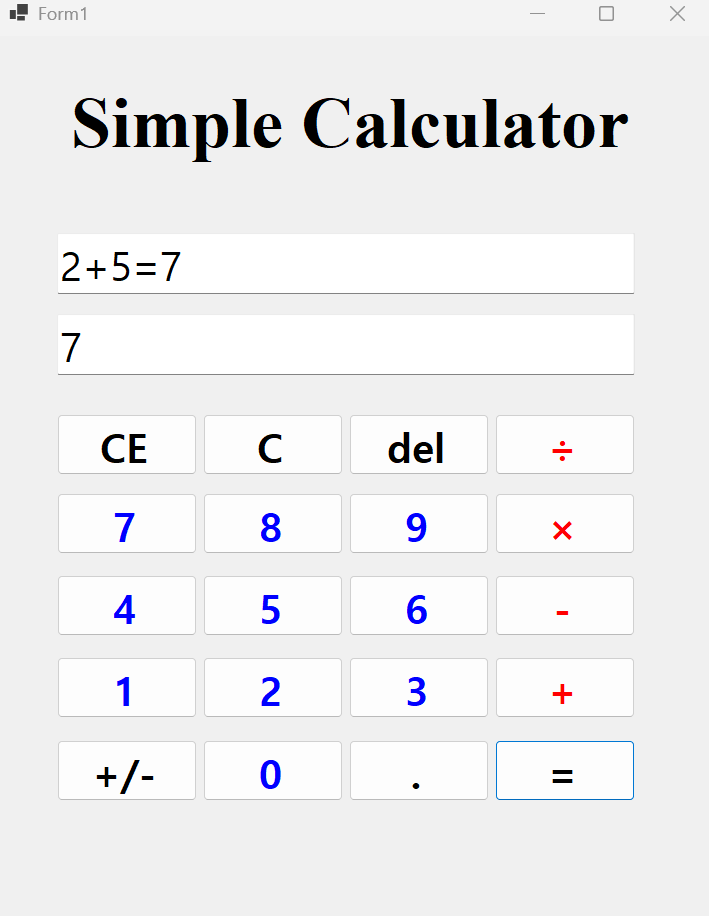
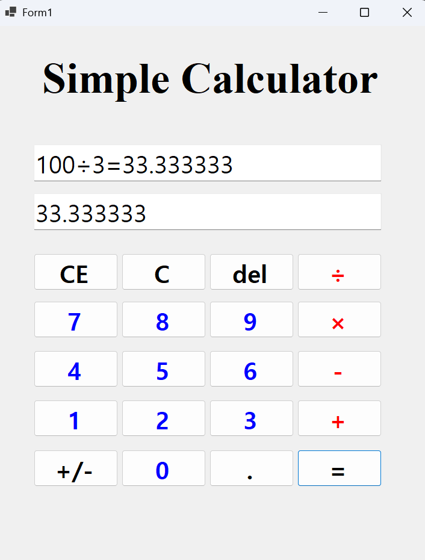

# (C# 코딩) 사측연산 계산기

## 개요

- 1줄 소개: 사측연산 계산기는 사측연산을 수행하는 계산기 프로그램입니다. 사용자는 입력한 수식에 대해 사측연산을 적용하여 결과를 얻을 수 있습니다.

- 사용한 플랫폼:

 - C#, .NET Windows Forms, Visual Stdio, GitHub

- 사용한 기술과 구현한 기능: 

 - 사용자가 입력한 수식에 대해 사측연산을 적용하여 결과를 계산하는 기능을 구현하였습니다.
 
 
 - 버튼을 누르면 Input창에 입력되게 하였습니다.
 
 
 - Input창엔 입력값을 모두 출력하고, output엔 그때 그때 누른 버튼을 출력하게 하였습니다.
 

##실행 화면 (과제1)

- 과제 내용

 - TextBox,Button 등을 적절히 배치

 - 숫자 Button 클릭 시 TextBox에 출력

 - 2개의 피연산자의 입력값을 Int로 바꾸어 더하기 계산을 수행하고 그 결과를 저장

 - 계산 결과 값을 문자열로 변환하여 표시

- 구현 내용과 기능 설명

 - TextBox와 Button을 적절히 배치하여 사용자 인터페이스를 구성하였습니다.

 - 숫자 Button 클릭 시 해당 숫자가 TextBox에 출력되도록 구현하였습니다.

 - 2개의 피연산자의 입력값을 Int로 변환하여 더하기 계산을 수행하고 그 결과를 저장하는 기능을 구현하였습니다.

 - 계산 결과 값을 문자열로 변환하여 TextBox에 표시하는 기능을 구현하였습니다.

 - Input창에는 사용자가 입력해온 버튼 모두 출력되고, Output창에는 방금 누른 버튼의 값이 출력되도록 구현하였습니다.

##실행 화면 (과제2)

- 과제 내용

 - 빼기, 곱하기, 나누기 구현

 - 뺄셈, 곱셈, 나눗셈 버튼 추가

 - 각 이벤트 연결

 - 각 버튼 클릭 시 연산자만 변경하여 동일 로직 적용

- 구현 내용과 기능 설명

 - 곱하기, 나누기, 빼기 계산이 되도록 구현

 - 나누기를 할 때 소수점 아래까지 나오도록 함

 - 0으로는 나눌 수 없도록 함

 - 계산의 결과 박스를 넘어가면 -가 출력되도록 함

